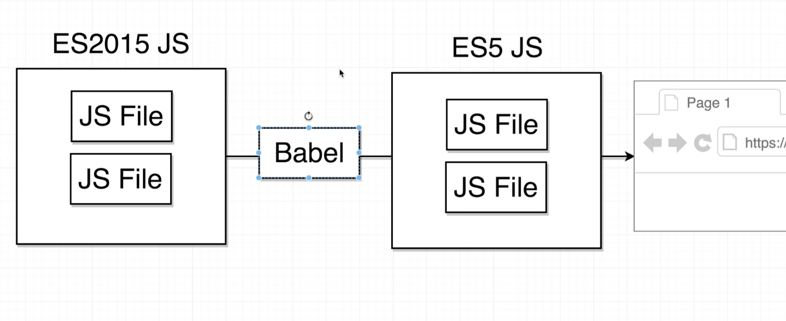
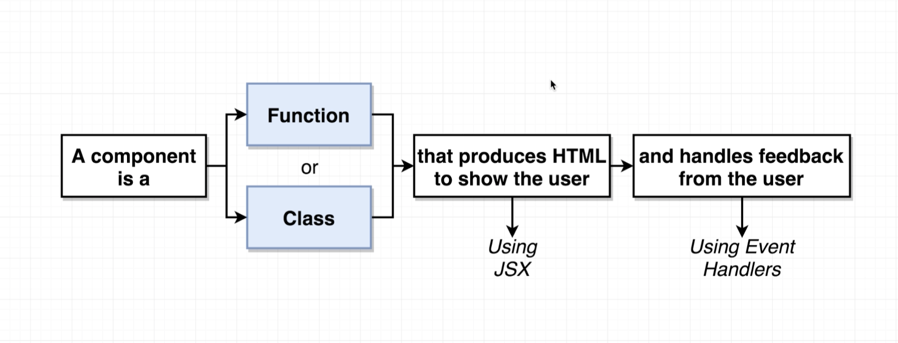
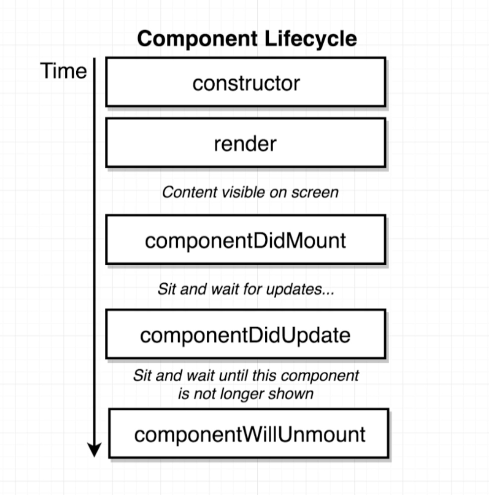

- **React.js** is a declarative, efficient, and flexible JavaScript library for building user interfaces. It lets you compose complex UIs from small and isolated pieces of code called **components**.
  - React manages **the creation and updating of DOM nodes in your Web page**

### Jump to...

- [React Scripts](#scriptss)
- [JSX](#jsx)
- [Components](#components)
  - [Functional Components](#functional-components)
  - [Class-based Components](#class-components)
  - [Nested Components](#nested-components)
- [Props](#props)
- [State](#state)
- [Fragments](#fragments)
---

## Creating a React App
```
npx create-react-app <app-name>
```
#### Project Directory
|Folder               |                                                             |
|---------------------|-------------------------------------------------------------|
| `src`               | Folder where we put all of the source code we write         |
| `public`            | Folder that stores static files, like images, or a HTML file|
| `node_modules`      | Folder that contains all of our project dependencies        |
| `package.json`      | Records our project dependencies and configures our project |
| `package-lock.json` | Records the exact version of packages that we install       |
| `README.md`         | Instructions on how to use this project                     |

### Available Scripts <a id="scripts"></a>

In the project directory, you can run:

#### `npm start`
- Runs the app in the development mode.
- Open [http://localhost:3000](http://localhost:3000) to view it in the browser.
- The page will reload if you make edits.
- You will also see any lint errors in the console.

#### `npm test`

- Launches the test runner in the interactive watch mode.
- See the section about [running tests](https://facebook.github.io/create-react-app/docs/running-tests) for more information.

#### `npm run build`

- Builds the app for production to the `build` folder.
- It correctly bundles React in production mode and optimizes the build for the best performance.
- The build is minified and the filenames include the hashes.
  - Your app is ready to be deployed!

See the section about [deployment](https://facebook.github.io/create-react-app/docs/deployment) for more information.

#### `npm run eject`

**Note: this is a one-way operation. Once you `eject`, you can’t go back!**

- If you aren’t satisfied with the build tool and configuration choices, you can `eject` at any time. This command will remove the single build dependency from your project.

- Instead, it will copy all the configuration files and the transitive dependencies (Webpack, Babel, ESLint, etc) right into your project so you have full control over them. All of the commands except `eject` will still work, but they will point to the copied scripts so you can tweak them. At this point you’re on your own.

- You don’t have to ever use `eject`. The curated feature set is suitable for small and middle deployments, and you shouldn’t feel obligated to use this feature. However we understand that this tool wouldn’t be useful if you couldn’t customize it when you are ready for it.

####  Import the React and ReactDOM libraries
```js
import React from 'react';
import ReactDOM from 'react-dom';
```

## JSX <a id="jsx"></a>
- JSX is a short form of *JavaScript Extended* and it is a way to write React components. Using JSX, you get the full power of JavaScript inside XML like tags.
- You put JavaScript expressions inside `{}`.
  - The way it works is you write JSX to describe what your UI should look like. A **transpiler** like `Babel` converts that code into a bunch of `React.createElement()` calls.
  
  - The React library then uses those `React.createElement()` calls to construct a tree-like structure of DOM elements (in case of React for Web) or Native views (in case of React Native) and keeps it in the memory.


#### HTML attributes in JSX
  - ###### Plain HTML:
  ```html
  <a class="nav-link" href="/home">
    
    Home
  </a>
  ```
  - ###### JSX:
  ```html
  const navList = (
    <ul>
      <li className="selected">
        <a href="/pets">Pets</a>
      </li>
      <li>
        <a href="/owners">Owners</a>
      </li>
    </ul>
  );
  ```
  - **Note: in JSX classes are referred to as `className`**


## Components <a id="components"></a>
- React applications are built as a combination of parent and child components. As the names suggest, each child component has a parent and a parent component will have one or more child components.
- A **component** is a reusable piece of code, which defines how certain features should look and behave on the UI

#### Create a react component
```js
const App = () => {
  return <div>Hi there!</div>;
};
```

#### Converting to virtual DOM
- Take the react component and show it on the screen
```js
ReactDOM.render(<App />, document.querySelector('#root'));
```

##### Updating the DOM


#### Functional vs Class Components



  - ##### Functional Component <a id="functional-components"></a>
    - A functional component in React consumes arbitrary data that you pass to it using `props` object. It returns an object which describes what UI React should render.
    - Functional components are also known as **Stateless components**.
      - You must return something from a function component. You **cannot return undefined from a function component**. If you don't want to render anything, then return null instead.
      ```js
      const App = (props) => {

        return <div></div>;
      };
      ```
  - ##### Class-based Component <a id="class-components"></a>
    - The class-based component has an additional property `state`, which you can use to hold a component’s private data.
    - Since these components have a state, these are also known as **Stateful components**.
      - We extend `React.Component` class of React library to make class-based components in React.
      - The `render()` method must be present in your class as React looks for this method in order to know what UI it should render on screen.
      ```js
      class App extends React.Component {
        constructor(props) {
          super(props);
        }

        render() {
          return <div></div>
        };
      }
      ```

  #### Class Component Lifecycle    
  

  - **all of these functions have the same result as the [`useEffect`](#useEffect) hook**

  ### Props <a id="props"></a>
  - Components receive data via an argument traditionally named `props`.
  -  React elements can accept `props` from its **parent** or from wherever it is created or rendered. `props` is an object that gets passed down from the **parent** function component into the **child** function component.
    - The **keys** of the `props` object passed into a function component is defined in the same way as an HTML attribute

  - ##### `React.Component` subclasses
      - A component takes in parameters, called `props` (short for “properties”), and returns a hierarchy of views to display via the `render` method.
        - The `render` method returns a *description* of what you want to see on the screen. React takes the description and displays the result.

    ```js
    class ShoppingList extends React.Component {
      render() {
        return (
          <div className="shopping-list">
            <h1>Shopping List for {this.props.name}</h1>
            <ul>
              <li>Instagram</li>
              <li>WhatsApp</li>
              <li>Oculus</li>
            </ul>
          </div>
        );
      }
    }

    // Example usage: <ShoppingList name="Mark" />
    ```
  - Here, `ShoppingList` is a **React component class**, or **React component type**.
  - The `<div />` syntax is transformed at build time to `React.createElement('div')`.
  - Example above is equivalent to:
```js
return React.createElement('div', {className: 'shopping-list'},
  React.createElement('h1', /* ... h1 children ... */),
  React.createElement('ul', /* ... ul children ... */)
);
```
  - ##### `React.PureComponent` subclasses
    - `React.PureComponent` is similar to `React.Component`. The difference between them is that `React.Component` doesn’t implement `shouldComponentUpdate()`, but `React.PureComponent` implements it with a shallow prop and state comparison.

#### Nested Function Components <a id="nested-components"></a>
- To render a function component in another function component, wrap the desired nested function component in JSX tags just like you would a regular HTML tag in the return of the outer function component.
  ```js
  function NavLinks() {
    return (
      <ul>
        <li className="selected">
          <a href="/pets">Pets</a>
        </li>
        <li>
          <a href="/owners">Owners</a>
        </li>
      </ul>
    );
  }

  function NavBar() {
    return (
      <nav>
        <h1>Pet App</h1>
        <NavLinks />
      </nav>
    );
  }
  ```
  - The `NavBar` component is the **parent** of the `NavLinks` component, which means `NavBar` is rendering the `NavLinks` component as its **child**.

###### Interpolating values into JSX with curly braces
```js
function NavBar() {
  const world = "world"
  return (
    <nav>
      <h1>Pet App</h1>
      <NavLinks hello={world} />
    </nav>
  );
}
```
  - `NavLinks` will know that the `props` key of `hello` has a value of `world`
  - React will invoke the `NavLinks` function with the `props` object as the first argument.
    - This is true for any function component. This means that you can expect the first parameter of a function component to be an object that has its keys and values determined by the parent component.

###### Destructing the `props` object
- Destructuring `props` can help make code more readable
- You can explicitly define which `props` the child component should be expecting by destructuring the `props` object in the function component's parameter.
```js
function NavLinks({ hello, color }) {
  return (
    <ul>
      <li>
        <a href="/hello">{hello}</a>
      </li>
      <li className="selected">
        <a href="/pets">Pets</a>
      </li>
      <li>
        <a href="/owners">Owners</a>
      </li>
    </ul>
  );
}
```

## State <a id="state"></a>
**State** is a JavaScript object that contains data relevant to a component
- State is similar to `props`, but it is private and fully controlled by the component. `props` don't change over time, but `state` does.
- State must be initialized when a component is created
- Updating `state` on a component causes the component to (almost) instantly rerender
  -  State can **only** be updated using the function `setState`
- **Only usable with class Components**
```js
class App extends React.Component {
  constructor(props) {
    super(props);

    this.state = { obj: null };

    window.function(
      object => {
        this.setState({ obj: object });
      }
    )
  }

  render() {
    return <div>Object: {this.state.obj}</div>
  };
}
```
|    | Chain of actions                                                  |
|----|-------------------------------------------------------------------|
| 1. | JS file loaded by browser                                         |
| 2. | Instance of `App` component is created                            |
| 3. | App components 'constructor' function gets called                 |
| 4. | State object is created and assigned to the `this.state` property |
| 5. | React calls the components render method                          |
| 6. | App returns JSX, gets rendered to page as HTML                    |

##### State in function components:
In order to use state in function components, you need to import `useState` from React
```js
import { useState } from 'react';
```
- While props are *immutable*, state changes over time. With *every* change to state, react will re-render the component.
## Hooks

#### useEffect Hook <a id="useEffect" ></a>
- The `useEffect` hook lets your perform side effects in your function components.
## Fragments <a id="fragments"></a>
- React also provides a component for rendering multiple elements without a wrapper.
  ### `React.Fragment`
  - The `React.Fragment` component lets you return multiple elements in a `render()` method without creating an additional DOM element:
  ```js
  render() {
    return (
      <React.Fragment>
        Some text.
        <h2>A heading</h2>
      </React.Fragment>
    );
  }
  ```

---
## React Methods
### Creating React Elements
- Each JSX element is just syntactic sugar for calling `React.createElement()`

  #### `createElement()`
  ```js
  React.createElement(
    type,
    [props],
    [...children]
  )
  ```
  - Create and return a new **React element** of the given type.
    - The type argument can be either a tag name string (such as `div` or `span`), a **React component** type (a class or a function), or a **React fragment type**.
  #### `createFactory()`
  ```js
  React.createFactory(type)
  ```
  - Return a function that produces React elements of a given type.
    - Like `React.createElement()`, the type argument can be either a tag name string (such as `div` or `span`), a React component type (a class or a function), or a React fragment type.
### Transforming Elements
  #### `cloneElement()`
  ```js
  React.cloneElement(
    element,
    [props],
    [...children]
  )
  ```
  - Clone and return a new React `element` using element as the starting point.
    - The resulting element will have the original element’s props with the new props merged in shallowly.
    - New children will replace existing children. `key` and `ref` from the original element will be preserved.
  #### `isValidElement()`
  ```js
  React.isValidElement(object)
  ```
  - Verifies the object is a React element. Returns `true` or `false`.
  #### `React.Children`
  ```js
  React.Children.map(children, function[(thisArg)])
  ```
  - `React.Children` provides utilities for dealing with the `this.props.children` opaque data structure
    - Invokes a function on every immediate child contained within `children` with this set to `thisArg`
  [Additional `children` functions](https://reactjs.org/docs/react-api.html#reactchildren)


---
